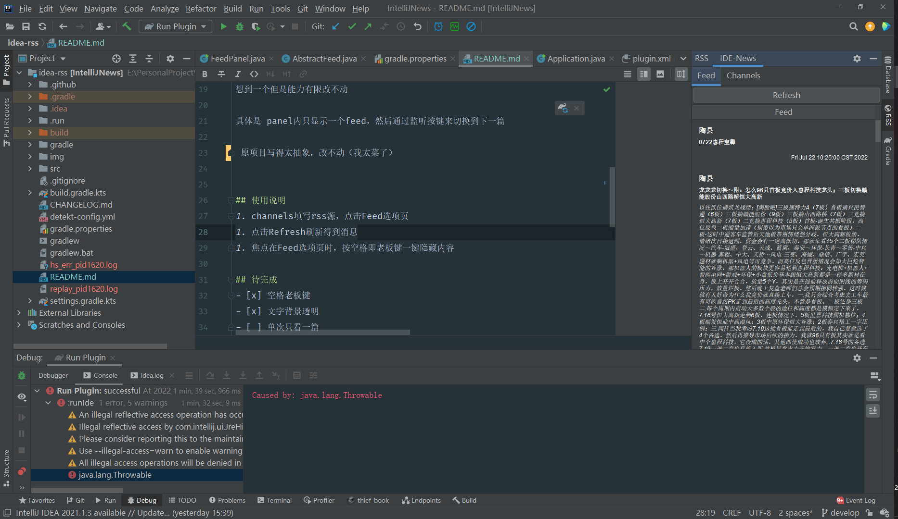
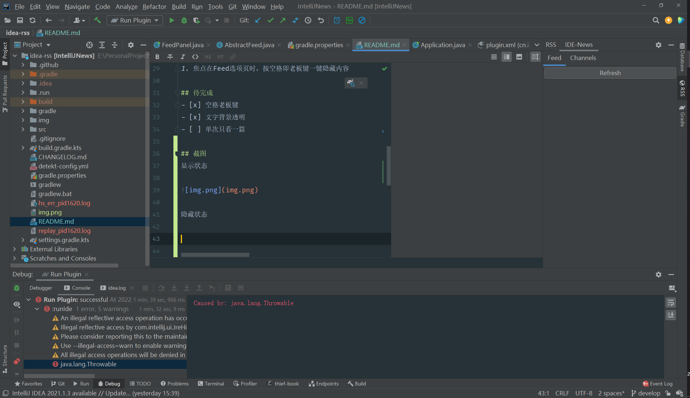

# IntelliJTaoGuBa

<!--   -->
<!--    -->

## 项目说明
程序员+炒股=此插件

韭菜们对陶县都不会陌生吧

本插件就是一个解析RSS的阅读器，RSS源为一个python脚本，定时抓取陶县的文章，在IDE内阅读

当然，在IDE比在网页上要安全一点

如果有什么更隐秘的想法，欢迎提出

想到一个但是能力有限改不动

具体是 panel内只显示一个feed，然后通过监听按键来切换到下一篇

 原项目写得太抽象，改不动（我太菜了）
 
 原项目应该是外国人写的而且好久没更新了，默认的自带源在国内是读不出的
 
 fork from [IDE-News](https://github.com/mikhirurg/IDE-News) 

## 使用说明
1. channels填写rss源，点击Feed选项页
1. 点击Refresh刷新得到消息
1. 焦点在Feed选项页时，按空格即老板键一键隐藏内容

## 待完成
- [x] 空格老板键
- [x] 文字背景透明
- [ ] 单次只看一篇

## 截图
显示状态

隐藏状态

## 爬取源说明
python脚本，需要python3.x以上。用到requests，bs4，json，PyRSS2Gen库
目前写得比较死，固定生成在/home/rss/rss.xml路径，大佬们可以修改成动态配置
业余python选手，不太会写
本来想写成web项目然后用定时器去爬取，后面搭建django写demo问题多多~太菜了，放弃了
然后不如用linux的定时器去启动脚本算了
有兴趣的大牛可以尝试下~然后把源分享出来~感激不尽~
目前只爬取接口的第一页，然后5分钟定时刷一次
本来想做成滚动加载的，但是滚动加载又好像直接爬没有必要做rss源了，遂放弃

<!-- Plugin description -->
IDE-News is a great plugin that allows you to subscribe to different RSS channels and read news not leaving the IDE.
<!-- Plugin description end -->

## 安装

- ~~Using IDE built-in plugin system:
  
  <kbd>Settings/Preferences</kbd> > <kbd>Plugins</kbd> > <kbd>Marketplace</kbd> > <kbd>Search for "IntelliJNews"</kbd> >
  <kbd>Install Plugin</kbd>
  
- Manually:

  Download the [latest release](https://github.com/mikh-rich-is-team/IntelliJNews/releases/latest) and install it manually using
  <kbd>Settings/Preferences</kbd> > <kbd>Plugins</kbd> > <kbd>⚙️</kbd> > <kbd>Install plugin from disk...</kbd>

---
Plugin based on the [IntelliJ Platform Plugin Template][template].

[template]: https://github.com/JetBrains/intellij-platform-plugin-template
